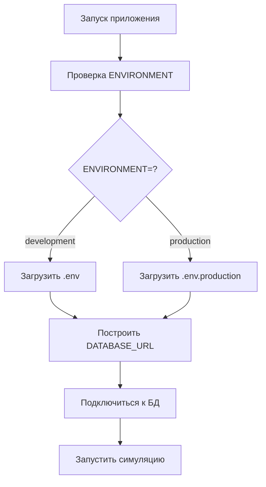

# 🌍 CAPSIM Environment Management Guide

## 🎯 **ЧТО ИЗМЕНИЛОСЬ**

Теперь CAPSIM поддерживает **единую систему переключения** между development и production окружениями через переменную `ENVIRONMENT`.

---

## 🚀 **БЫСТРЫЙ СТАРТ**

### **1. Текущий статус**
```bash
# Проверить текущее окружение
python scripts/switch_environment.py status
```

### **2. Переключение на production**
```bash
# Переключиться на production
python scripts/switch_environment.py switch production

# Скопировать production настройки в .env (опционально)
# Скрипт спросит: "Copy production settings to .env? (y/N)"
```

### **3. Возврат к development**
```bash
# Вернуться к development
python scripts/switch_environment.py switch development
```

### **4. Валидация конфигурации**
```bash
# Проверить текущую конфигурацию
python scripts/switch_environment.py validate

# Проверить конкретное окружение
python scripts/switch_environment.py validate production
```

---

## ⚙️ **ФАЙЛОВАЯ СТРУКТУРА**

```
capsim/
├── .env                    # Активная конфигурация (development по умолчанию)
├── .env.production         # Production настройки (заполните своими данными)
├── .env.example            # Шаблон конфигурации
└── scripts/
    └── switch_environment.py # Утилита переключения окружений
```

---

## 🔧 **НАСТРОЙКА PRODUCTION**

### **Шаг 1: Заполните .env.production**
```bash
# Откройте файл .env.production и замените placeholder значения:
POSTGRES_HOST=your-production-host.com
POSTGRES_PORT=5432
POSTGRES_DB=capsim_production
POSTGRES_USER=capsim_user
POSTGRES_PASSWORD=your_secure_production_password

# И остальные переменные...
```

### **Шаг 2: Создайте пользователей БД на production сервере**
```sql
-- На вашем production PostgreSQL сервере:
CREATE USER capsim_rw WITH PASSWORD 'your_secure_rw_password';
CREATE USER capsim_ro WITH PASSWORD 'your_secure_ro_password';

GRANT ALL PRIVILEGES ON DATABASE capsim_production TO capsim_rw;
GRANT SELECT ON ALL TABLES IN SCHEMA capsim TO capsim_ro;
```

### **Шаг 3: Примените миграции**
```bash
# Переключитесь на production
ENVIRONMENT=production alembic upgrade head

# Или с явным указанием окружения
python scripts/switch_environment.py switch production
alembic upgrade head
```

---

## 📁 **ЧТО БЫЛО ИСПРАВЛЕНО**

### **✅ Файлы без hardcoded подключений:**
- **alembic.ini** - теперь использует переменные `%(POSTGRES_HOST)s`, `%(POSTGRES_PORT)s`
- **monitoring/grafana-datasources.yml** - использует `${POSTGRES_HOST}`, `${POSTGRES_PASSWORD}`
- **docker-compose.yml** - использует `${DATABASE_URL}` вместо hardcoded строк
- **capsim/common/db_config.py** - environment-aware конфигурация
- **Все скрипты** - используют environment-aware fallback вместо hardcoded localhost

### **✅ Новые возможности:**
- **Единая система переключения** через `ENVIRONMENT=development|production`
- **Автоматический выбор** правильного .env файла
- **SSL поддержка** для production (sslmode=require)
- **Валидация конфигурации** перед запуском
- **Environment-aware fallback** для всех скриптов

---

## 🔄 **АЛГОРИТМ РАБОТЫ**



### **Приоритет переменных:**
1. **DATABASE_URL** из env (если установлен)
2. **Отдельные переменные** POSTGRES_* 
3. **Environment-aware fallback** (зависит от ENVIRONMENT)

---

## 🚨 **ВАЖНЫЕ ОСОБЕННОСТИ**

### **Development режим:**
- SSL отключен (`sslmode` не используется)
- Fallback на `localhost:5432`
- Использует `.env` файл

### **Production режим:**
- SSL включен (`sslmode=require`)
- Fallback на production хост из переменных
- Использует `.env.production` файл
- Строгая валидация конфигурации

### **Docker поддержка:**
- При `DOCKER_ENV=true` использует docker-compose переменные
- При `ENVIRONMENT=production` + Docker использует внешнюю БД

---

## 🧪 **ТЕСТИРОВАНИЕ КОНФИГУРАЦИИ**

### **Проверка подключения к БД:**
```bash
# Development
ENVIRONMENT=development python -c "
from capsim.common.db_config import ASYNC_DSN
print(f'Dev DSN: {ASYNC_DSN}')
"

# Production  
ENVIRONMENT=production python -c "
from capsim.common.db_config import ASYNC_DSN
print(f'Prod DSN: {ASYNC_DSN}')
"
```

### **Тест реального подключения:**
```bash
# Установить environment и протестировать
export ENVIRONMENT=production
python -c "
import asyncio
import asyncpg
from capsim.common.db_config import ASYNC_DSN

async def test():
    try:
        conn = await asyncpg.connect(ASYNC_DSN)
        result = await conn.fetchval('SELECT 1')
        print(f'✅ Connection successful: {result}')
        await conn.close()
    except Exception as e:
        print(f'❌ Connection failed: {e}')

asyncio.run(test())
"
```

---

## 🎛️ **КОМАНДЫ УТИЛИТЫ**

```bash
# Показать статус
python scripts/switch_environment.py
python scripts/switch_environment.py status

# Переключить окружение  
python scripts/switch_environment.py switch development
python scripts/switch_environment.py switch production

# Валидировать конфигурацию
python scripts/switch_environment.py validate
python scripts/switch_environment.py validate production

# Помощь
python scripts/switch_environment.py help
```

---

## 🚀 **ГОТОВО К PRODUCTION!**

Система теперь полностью готова к переносу на production хостинг:

1. ✅ Все hardcoded подключения убраны
2. ✅ Единая система управления окружениями  
3. ✅ Environment-aware конфигурация
4. ✅ SSL поддержка для production
5. ✅ Валидация и тестирование конфигурации
6. ✅ Обратная совместимость с development

**Просто заполните `.env.production` своими данными и переключайтесь командой!** 🎉