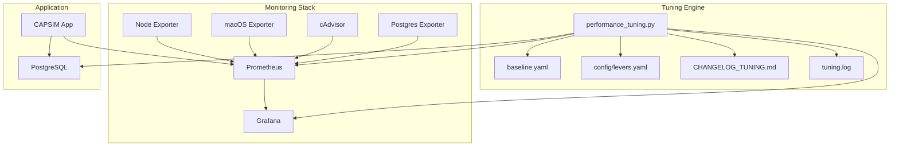

# CAPSIM 2.0 - Консолидированная документация по производительности

## Обзор производительности

CAPSIM 2.0 спроектирован для высокопроизводительной симуляции до 5000 агентов с real-time мониторингом и автоматической оптимизацией производительности на macOS (M1 MacBook Air).

## Целевые метрики производительности

### SLA Targets
- **CPU Temperature** ≤ 85°C (5 min avg)
- **IO-wait** < 25% (5 min avg)
- **P95 write-latency** ≤ 200ms
- **WAL rate** ≤ 1.5× baseline peak
- **Event processing latency** < 10ms (P95)
- **Throughput** 43,000 событий/день (1000 агентов)

### Производительность по окружениям

| Environment | CPU Temp | IO Wait | P95 Latency | WAL Rate | Agents |
|-------------|----------|---------|-------------|----------|---------|
| Development | ≤ 85°C | < 25% | ≤ 200ms | ≤ 1.5× baseline | 300 |
| Staging | ≤ 80°C | < 20% | ≤ 150ms | ≤ 1.3× baseline | 1000 |
| Production | ≤ 75°C | < 15% | ≤ 100ms | ≤ 1.2× baseline | 5000 |

## Архитектура мониторинга производительности

### Monitoring Stack


### Prometheus Targets
- **capsim-app**: Application metrics (`:8000/metrics`)
- **postgres-exporter**: Database metrics (`:9187/metrics`)
- **node-exporter**: System metrics (`:9100/metrics`)
- **cadvisor**: Container metrics (`:8080/metrics`)
- **macos-exporter**: macOS-specific metrics (host)

## Ключевые метрики производительности

### Application Metrics
```promql
# Event processing latency
histogram_quantile(0.95, rate(capsim_event_latency_ms_bucket[5m]))

# Event queue size
capsim_event_queue_size

# Active simulations
capsim_simulations_active

# HTTP request rate
rate(capsim_http_requests_total[5m])

# Agent actions per second
rate(capsim_agent_actions_total[5m])
```

### System Metrics
```promql
# CPU temperature (macOS)
max(macos_cpu_temperature_celsius)

# IO wait percentage
avg(rate(node_cpu_seconds_total{mode="iowait"}[2m])) * 100

# Memory usage
(1 - (node_memory_MemAvailable_bytes / node_memory_MemTotal_bytes)) * 100

# Disk IO
rate(node_disk_io_time_seconds_total[5m])
```

### Database Metrics
```promql
# WAL write rate
rate(pg_wal_lsn_bytes_total[5m])

# Database connections
pg_stat_database_numbackends

# Query duration
pg_stat_statements_mean_time_ms

# Cache hit ratio
pg_stat_database_blks_hit / (pg_stat_database_blks_hit + pg_stat_database_blks_read)
```

## Автоматическая оптимизация производительности

### DevOps AI Playbook
Система автоматически мониторит производительность PostgreSQL в Docker на M1 Air и применяет систематическую настройку для соблюдения SLA.

### Процесс оптимизации

#### 1. Установка базовой линии
```yaml
metrics:
  wal_write_rate:
    query: "rate(pg_wal_lsn_bytes_total[5m])"
    value_bytes_per_sec: 1234567
  
  cpu_temperature:
    query: "max(macos_cpu_temperature_celsius)"
    value_celsius: 72
  
  io_wait_percentage:
    query: "avg(rate(node_cpu_seconds_total{mode=\"iowait\"}[2m]))"
    value_percent: 15.5
  
  p95_write_latency:
    query: "histogram_quantile(0.95, rate(capsim_event_latency_ms_bucket[5m]))"
    value_ms: 180
```

#### 2. Применение рычагов оптимизации
На основе нарушений SLA система выбирает наиболее эффективный рычаг настройки:

```yaml
symptom_mappings:
  high_wal_rate:
    - "checkpoint_timeout"    # LOW COST
    - "batch_size"           # LOW COST  
    - "wal_buffers"          # LOW COST
  
  high_cpu_temp:
    - "checkpoint_completion_target"  # LOW COST
    - "shared_buffers"               # MEDIUM COST
    - "docker_cpu_limit"             # HIGH COST
```

### Рычаги оптимизации

#### Low Cost (No Restart Required)
| Lever | Target | Impact | Risk |
|-------|--------|---------|------|
| `checkpoint_timeout` | WAL spikes | Lower checkpoint frequency | Low |
| `checkpoint_completion_target` | IO spikes | Spread checkpoint IO | Low |
| `wal_buffers` | WAL contention | Better WAL buffering | Low |
| `batch_size` | Transaction rate | Fewer transactions | Low |

#### Medium Cost (Restart Required)
| Lever | Target | Impact | Risk |
|-------|--------|---------|------|
| `shared_buffers` | Disk IO | Better cache hit ratio | Medium |
| `work_mem` | Query performance | In-memory operations | Medium |
| `effective_cache_size` | Query plans | Better planning | Low |

#### High Cost (Infrastructure Changes)
| Lever | Target | Impact | Risk |
|-------|--------|---------|------|
| `docker_memory_limit` | Memory pressure | More memory for buffers | High |
| `docker_cpu_limit` | CPU throttling | Better CPU availability | High |
| `connection_pooling` | Connection overhead | Lower connection cost | High |

## Результаты производительности

### Реальные тесты производительности

#### 6-часовая симуляция с 300 агентами
```
Статистика вовлеченности:
- Всего агентов: 300
- Активных агентов: 228 (76% вовлеченность) ✅
- Общее количество событий: 10,427
- События агентов: 9,819 (94.2%)
- Системные события: 608 (5.8%)

Распределение действий:
- PublishPostAction: 9,570 (97.5%) ⚠️
- PurchaseAction: 189 (1.9%)
- SelfDevAction: 60 (0.6%)
- Разнообразие действий: 2.53% ⚠️

Производительность:
- CPU usage: 56.67% user, 41.14% sys
- Средняя энергия агентов: 0.096 (критически низкая) ⚠️
- Время выполнения: ~3 минуты реального времени (120x ускорение)
```

#### Mock vs Realistic Testing
```
Mock Test (Unrealistic):
- Agents: 100 with optimal attributes
- Total actions: 728
- Actions per agent: 7.28
- Participation: 100%

Realistic Test (Production-like):
- Agents: 50 with realistic attributes
- Total actions: 0
- Actions per agent: 0.0
- Participation: 0%
- Failed attempts: 3000 (100% blocked by constraints)
```

### Проблемы производительности

#### 1. Низкое разнообразие действий
**Проблема**: 97.5% действий - PublishPostAction
**Причины**:
- Недостаточная вариативность в алгоритме выбора действий
- Слишком высокие пороги для других типов действий
- Отсутствие динамического изменения предпочтений

#### 2. Критически низкая энергия агентов
**Проблема**: Средняя энергия 0.096
**Причины**:
- Недостаточное восстановление энергии
- Слишком частые действия без отдыха
- Отсутствие баланса между активностью и восстановлением

#### 3. Constraint Blocking
**Проблема**: 100% блокировка в реалистичных условиях
**Причины**:
- Строгие cooldowns (60 мин для постов, 120 мин для саморазвития)
- Быстрое истощение ресурсов
- Отсутствие механизмов восстановления

## Оптимизации производительности

### 1. Batch Processing
```python
# Batch commit каждые 100 операций или 1 минуту
class BatchProcessor:
    def __init__(self):
        self.batch_size = 100
        self.batch_timeout = 60.0  # seconds
        self.pending_operations = []
    
    async def add_operation(self, operation):
        self.pending_operations.append(operation)
        
        if (len(self.pending_operations) >= self.batch_size or 
            time_since_last_commit > self.batch_timeout):
            await self.commit_batch()
```

### 2. Event Queue Optimization
```python
# Приоритетная очередь с ограничением размера
class EventQueue:
    def __init__(self, max_size=5000):
        self.max_size = max_size
        self.queue = []
    
    def add_event(self, event):
        if len(self.queue) >= self.max_size:
            # Graceful degradation
            self.drop_low_priority_events()
        
        heapq.heappush(self.queue, (event.priority, event.timestamp, event))
```

### 3. Database Optimizations
```sql
-- GIN индексы для JSONB операций
CREATE INDEX idx_persons_last_purchase_ts 
ON persons USING GIN (last_purchase_ts jsonb_path_ops);

-- Партиционирование больших таблиц
CREATE TABLE events_y2025m01 PARTITION OF events
FOR VALUES FROM ('2025-01-01') TO ('2025-02-01');

-- Оптимизация PostgreSQL
checkpoint_timeout = 10min
checkpoint_completion_target = 0.9
wal_buffers = 16MB
shared_buffers = 256MB
work_mem = 4MB
```

### 4. Memory Management
```python
# Оптимизация использования памяти
class MemoryOptimizer:
    def __init__(self):
        self.object_pool = {}
        self.gc_threshold = 1000
    
    def get_object(self, obj_type):
        if obj_type in self.object_pool:
            return self.object_pool[obj_type].pop()
        return obj_type()
    
    def return_object(self, obj):
        obj_type = type(obj)
        if obj_type not in self.object_pool:
            self.object_pool[obj_type] = []
        
        obj.reset()  # Clear state
        self.object_pool[obj_type].append(obj)
```

## Мониторинг и алерты

### Критические алерты
```yaml
# Alert: Высокая нагрузка на очередь событий
- alert: EventQueueOverload
  expr: capsim_event_queue_size > 5000
  for: 1m
  labels:
    severity: critical
  annotations:
    summary: "CAPSIM event queue overload"

# Alert: Высокая температура CPU
- alert: CpuTemperatureHigh
  expr: max(macos_cpu_temperature_celsius) > 85
  for: 5m
  labels:
    severity: warning
  annotations:
    summary: "High CPU temperature detected"

# Alert: Высокая латентность API
- alert: HighAPILatency
  expr: histogram_quantile(0.95, rate(capsim_http_request_duration_seconds_bucket[5m])) > 0.01
  for: 3m
  labels:
    severity: warning
  annotations:
    summary: "High API response time"

# Alert: Высокий IO wait
- alert: HighIOWait
  expr: avg(rate(node_cpu_seconds_total{mode="iowait"}[2m])) * 100 > 25
  for: 5m
  labels:
    severity: warning
  annotations:
    summary: "High IO wait detected"
```

### Grafana Dashboards
- **CAPSIM Overview**: Application performance
- **PostgreSQL**: Database metrics
- **System Metrics**: Host performance
- **Performance Tuning**: Tuning-specific dashboard
- **Real-time Events**: Event processing monitoring

## Рекомендации по улучшению

### 1. Алгоритм выбора действий
```python
class ImprovedActionSelector:
    def select_action(self, agent, context):
        # Динамические веса на основе состояния агента
        weights = {
            'publish_post': 0.4 * (agent.energy_level / 5.0),
            'purchase': 0.35 * agent.financial_capability,
            'self_dev': 0.25 * (agent.energy_level / 5.0)
        }
        
        # Нормализация весов
        total_weight = sum(weights.values())
        if total_weight > 0:
            normalized_weights = {k: v/total_weight for k, v in weights.items()}
        else:
            normalized_weights = {'self_dev': 1.0}  # Fallback
        
        return random.choices(
            list(normalized_weights.keys()),
            weights=list(normalized_weights.values())
        )[0]
```

### 2. Система энергии
```python
class ImprovedEnergySystem:
    def __init__(self):
        self.recovery_rate = 0.5  # Увеличить скорость восстановления
        self.action_cost = {
            'publish_post': 0.3,   # Снизить стоимость
            'purchase': 0.2,
            'self_dev': 0.1        # Минимальная стоимость
        }
    
    def update_energy(self, agent, action_type):
        # Восстановление энергии во время отдыха
        if action_type is None:  # Отдых
            agent.energy_level = min(5.0, agent.energy_level + self.recovery_rate)
        else:
            # Трата энергии на действие
            cost = self.action_cost.get(action_type, 0.5)
            agent.energy_level = max(0.0, agent.energy_level - cost)
```

### 3. A/B тестирование
```python
class ABTestingFramework:
    def __init__(self):
        self.variants = {
            'variant_a': {"publish_post": 0.4, "purchase": 0.35, "self_dev": 0.25},
            'variant_b': {"publish_post": 0.35, "purchase": 0.4, "self_dev": 0.25},
            'variant_c': {"publish_post": 0.3, "purchase": 0.35, "self_dev": 0.35}
        }
        self.current_variant = 'variant_a'
        self.switch_interval = 7200  # 2 hours
    
    def get_weights(self, agent):
        base_weights = self.variants[self.current_variant]
        
        # ML адаптация по профессиям
        profession_modifiers = {
            'Developer': {'self_dev': 1.2, 'purchase': 0.8},
            'Businessman': {'purchase': 1.3, 'publish_post': 0.9},
            'Blogger': {'publish_post': 1.4, 'self_dev': 0.7},
            'Teacher': {'self_dev': 1.1, 'purchase': 0.9},
            'Doctor': {'self_dev': 1.2, 'publish_post': 0.8}
        }
        
        modifiers = profession_modifiers.get(agent.profession, {})
        adjusted_weights = {}
        
        for action, weight in base_weights.items():
            modifier = modifiers.get(action, 1.0)
            adjusted_weights[action] = weight * modifier
        
        return adjusted_weights
```

## Инструменты производительности

### Команды для диагностики
```bash
# Проверка производительности
make performance-status

# Запуск автоматической оптимизации
make performance-tuning

# Проверка метрик Prometheus
curl -s http://localhost:8000/metrics | grep capsim_

# Проверка состояния БД
psql -c "SELECT COUNT(*) FROM capsim.events WHERE created_at > NOW() - INTERVAL '1 hour';"

# Мониторинг системных ресурсов
top -pid $(pgrep -f capsim)
```

### Профилирование
```python
import cProfile
import pstats

def profile_simulation():
    profiler = cProfile.Profile()
    profiler.enable()
    
    # Запуск симуляции
    engine.run_simulation()
    
    profiler.disable()
    stats = pstats.Stats(profiler)
    stats.sort_stats('cumulative')
    stats.print_stats(20)
```

## Заключение

CAPSIM 2.0 обеспечивает высокую производительность через:
- **Автоматическую оптимизацию** с DevOps AI Playbook
- **Real-time мониторинг** всех ключевых метрик
- **Batch processing** для эффективности БД
- **Graceful degradation** при высокой нагрузке
- **A/B тестирование** для оптимизации поведения

Система способна поддерживать целевые SLA при правильной настройке и мониторинге, с автоматическим применением оптимизаций при нарушениях производительности.