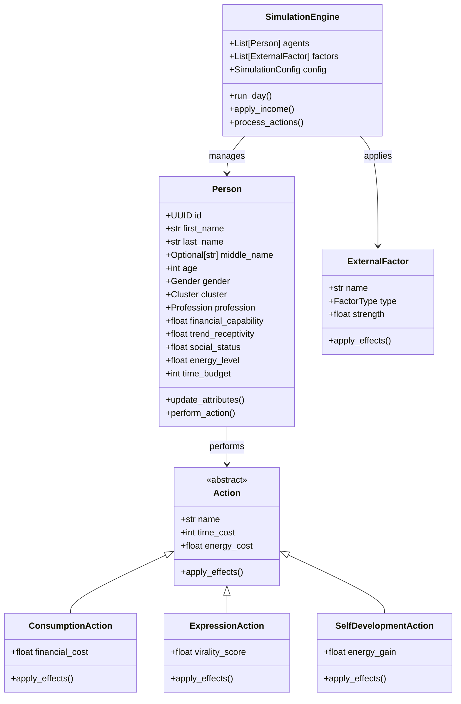

## Технологический стек

- **Poetry**: Управление зависимостями и проектом
- **Pydantic**: Валидация данных и сериализация
- **Typer**: CLI интерфейс
- **Faker**: Генерация демографических данных
- **Numpy**: Математические операции


## Ключевые компоненты

1. **Models**: Определение структуры данных
   - Person: Модель агента
   - Action: Базовый класс действий
   - ExternalFactor: Внешние факторы

2. **Simulation**: Ядро симуляции
   - Engine: Управление симуляцией
   - Config: Конфигурация симуляции

3. **Actions**: Реализация действий
   - Consumption: Покупки
   - Expression: Публикации
   - SelfDevelopment: Саморазвитие

## Жизненный цикл симуляции

1. Инициализация
2. Дневной цикл
3. Обработка действий
4. Применение факторов
5. Финализация


# docs/architecture/class_diagram.md

# UML Диаграмма классов


```

```markdown
# docs/architecture/simulation_flow.md

# Поток симуляции

## Инициализация

1. Загрузка конфигурации
2. Создание агентов:
   - Генерация демографических данных
   - Установка начальных атрибутов
3. Инициализация внешних факторов

## Дневной цикл

1. **Доход**
   - Применение базового дохода
   - Учет возрастного коэффициента

2. **Восстановление ресурсов**
   - Восстановление time_budget
   - Частичное восстановление energy_level

3. **Действия агентов**
   - Выбор действий по приоритету
   - Применение эффектов
   - Обновление ресурсов

4. **Внешние факторы**
   - Применение глобальных эффектов
   - Обновление атрибутов агентов

5. **Финализация**
   - Ограничение атрибутов
   - Сохранение состояния
```

```markdown
# docs/architecture/data_models.md

# Модели данных

## Person

Основная модель агента симуляции.

### Атрибуты
- id: UUID
- first_name: str
- last_name: str
- middle_name: Optional[str]
- age: int (18-75)
- gender: Gender (Male/Female)
- cluster: Cluster (Worker/Social/Spiritual/Other)
- profession: str
- financial_capability: float (0.0-10.0)
- trend_receptivity: float (1.0-5.0)
- social_status: float (1.0-5.0)
- energy_level: float (1.0-5.0)
- time_budget: int (1-5)

## Action

Базовый класс для всех действий.

### Атрибуты
- name: str
- time_cost: int
- energy_cost: float

### Методы
- apply_effects(person: Person) -> None

## ExternalFactor

Модель внешнего фактора.

### Атрибуты
- name: str
- type: FactorType
- strength: float

### Методы
- apply_effects(agents: List[Person]) -> None


# docs/architecture/simulation_flow.md

# Поток симуляции

## Инициализация

1. Загрузка конфигурации
2. Создание агентов:
   - Генерация демографических данных
   - Установка начальных атрибутов
3. Инициализация внешних факторов

## Дневной цикл

1. **Доход**
   - Применение базового дохода
   - Учет возрастного коэффициента

2. **Восстановление ресурсов**
   - Восстановление time_budget
   - Частичное восстановление energy_level

3. **Действия агентов**
   - Выбор действий по приоритету
   - Применение эффектов
   - Обновление ресурсов

4. **Внешние факторы**
   - Применение глобальных эффектов
   - Обновление атрибутов агентов

5. **Финализация**
   - Ограничение атрибутов
   - Сохранение состояния

# docs/architecture/data_models.md

# Модели данных

## Person

Основная модель агента симуляции.

### Атрибуты
- id: UUID
- first_name: str
- last_name: str
- middle_name: Optional[str]
- age: int (18-75)
- gender: Gender (Male/Female)
- cluster: Cluster (Worker/Social/Spiritual/Other)
- profession: str
- financial_capability: float (0.0-10.0)
- trend_receptivity: float (1.0-5.0)
- social_status: float (1.0-5.0)
- energy_level: float (1.0-5.0)
- time_budget: int (1-5)

## Action

Базовый класс для всех действий.

### Атрибуты
- name: str
- time_cost: int
- energy_cost: float

### Методы
- apply_effects(person: Person) -> None

## ExternalFactor

Модель внешнего фактора.

### Атрибуты
- name: str
- type: FactorType
- strength: float

### Методы
- apply_effects(agents: List[Person]) -> None
