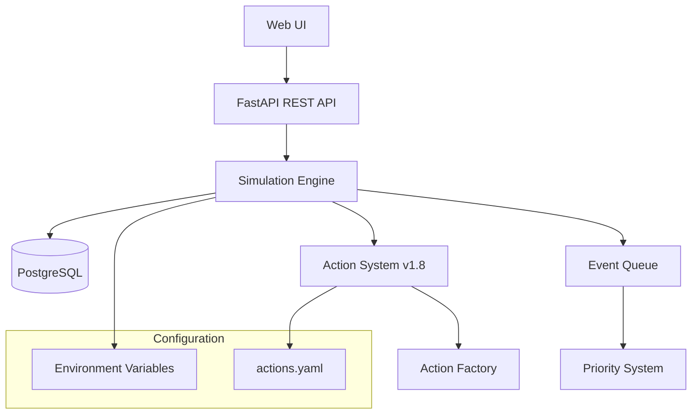

# CAPSIM 2.0 Architecture Overview

## System Architecture

CAPSIM 2.0 использует event-driven архитектуру с четким разделением уровней:

## Core Components

### 1. Simulation Engine
- **Дискретно-событийная симуляция** (DES)
- **Приоритетная очередь событий** с временными метками
- **Batch-commit механизм** для производительности
- **Realtime mode** с настраиваемой скоростью

### 2. Action System v1.8 (NEW)
- **Action Factory Pattern** для создания действий агентов
- **Унифицированная система эффектов** через YAML конфигурацию
- **Cooldown система** для ограничения частоты действий
- **Покупки L1/L2/L3** с финансовыми порогами

### 3. Agent System
- **Персоны** с динамическими атрибутами
- **Матрица интересов** 7x11 профессий vs тем
- **Принятие решений** на основе weighted scoring

### 4. Event System
- **Приоритеты v1.8**: SYSTEM (100), AGENT_ACTION (50), LOW (0)
- **Системные события**: DailyReset, EnergyRecovery
- **Агентские события**: Post, Purchase, SelfDev

## Data Layer

### Database Schema
- **PostgreSQL 15** с схемой `capsim`
- **agents_profession** – статичная таблица диапазонов атрибутов (min/max) по профессиям
- **JSONB** поля для гибкого хранения (interests, purchase_history)
- **UUID** primary keys для масштабируемости
- **Temporal tracking** для аудита изменений

### New v1.8 Fields
- `purchases_today SMALLINT` - дневной лимит покупок
- `last_post_ts DOUBLE PRECISION` - timestamp последнего поста
- `last_selfdev_ts DOUBLE PRECISION` - timestamp саморазвития
- `last_purchase_ts JSONB` - история покупок по уровням

## Configuration Management

### Environment Variables (34 variables)
- **Database**: DATABASE_URL, DATABASE_URL_RO
- **Performance**: BATCH_SIZE, SIM_SPEED_FACTOR, CACHE_*
- **v1.8 Actions**: POST_COOLDOWN_MIN, SELF_DEV_COOLDOWN_MIN
- **Monitoring**: ENABLE_METRICS, LOG_LEVEL

### YAML Configuration
- **actions.yaml**: Эффекты действий, cooldowns, shop weights
- **simulation.yaml**: Параметры профессий и атрибутов
- **trend_affinity.json**: Матрица интересов 7x11

## API Layer

### REST Endpoints
- `POST /api/v1/simulations` - создание симуляции
- `GET /api/v1/simulations/{id}/status` - статус
- `GET /api/v1/simulations/{id}/agents` - список агентов
- `GET /api/v1/trends` - активные тренды

### Health & Monitoring
- `/healthz` - health check
- `/metrics` - Prometheus метрики
- **Real-time monitoring** через Grafana

## External Interfaces

- **REST API**: создание/управление симуляциями, получение агентов и трендов
- **Metrics**: `/metrics` endpoint для Prometheus
- **Health Check**: `/healthz` endpoint для мониторинга состояния
- **Configuration**: ENV переменные + YAML конфигурация + v1.8 Actions

## v1.8 Architectural Changes

### Action System Redesign
1. **Centralized Configuration**: Все эффекты в `config/actions.yaml`
2. **Factory Pattern**: Унифицированное создание действий
3. **Shop Weights**: Профессиональные модификаторы покупок
4. **Purchase Levels**: L1/L2/L3 с разными порогами и эффектами

### Enhanced Event Priorities
- **Simplified Priority System**: 3 уровня вместо 5
- **SYSTEM Events**: Высший приоритет для системных операций
- **AGENT_ACTION Events**: Средний приоритет для действий агентов

### Performance Optimizations
- **Cooldown Tracking**: Эффективная проверка временных ограничений
- **JSONB Indexing**: GIN индексы для быстрого поиска покупок
- **Batch Updates**: Групповые обновления состояния агентов

## Technology Stack

- **Python 3.11** - основной язык
- **FastAPI** - веб-фреймворк
- **SQLAlchemy 2.0** - ORM с async поддержкой
- **PostgreSQL 15** - основная база данных
- **Alembic** - миграции схемы
- **Prometheus** - метрики и мониторинг
- **Docker** - контейнеризация
- **YAML** - конфигурационные файлы v1.8