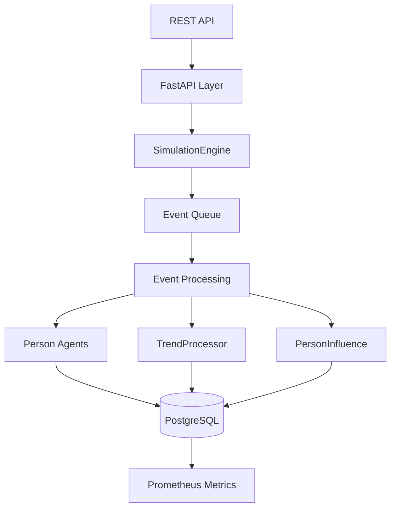

# Architecture Overview - CAPSIM 2.0

## High-Level System Description

CAPSIM 2.0 — это дискретно-событийная симуляция социальных взаимодействий между агентами различных профессий. Система моделирует распространение трендов через социальные сети с учетом влияния внешних факторов.

## Core Components

### SimulationEngine
Центральный координатор всех операций симуляции:
- Управляет приоритетной очередью событий (LAW=1, WEATHER=2, TREND=3, AGENT_ACTION=4, SYSTEM=5)
- Координирует жизненный цикл симуляции
- Обеспечивает batch-commit операции (100 изменений или 1 минута симуляции)

### Person (Agents)
Агенты с 12 типами профессий и динамическими атрибутами:
- `energy_level` (0.0-5.0) - восстанавливается каждые 24 часа
- `time_budget` (0-5) - зависит от профессии, сбрасывается ежедневно  
- `trend_receptivity` (0.0-5.0) - готовность реагировать на тренды
- `social_status` (0.0-5.0) - социальное влияние и авторитет

### TrendProcessor
Управление жизненным циклом трендов:
- Создание трендов через PublishPostAction
- Расчет виральности по формуле: `α×social_status + β×affinity + γ×energy`
- Автоматическое архивирование неактивных трендов (3 дня без взаимодействий)

### PersonInfluence
Обработка социального влияния:
- Фильтрация аудитории по coverage_level и affinity_map
- Расчет изменений атрибутов агентов от воздействия трендов
- Batch-обновление состояний через UpdateState пакеты

## System Flow

## Event Processing Architecture

1. **Event Generation**: Агенты генерируют события согласно экспоненциальному распределению
2. **Priority Queue**: События сортируются по приоритету и временным меткам
3. **Processing**: SimulationEngine обрабатывает события согласно типу
4. **State Updates**: Изменения агрегируются в batch для массового commit
5. **Persistence**: Batch-commit в PostgreSQL каждые 100 операций или 1 минуту

## Performance Characteristics

- **Throughput**: до 43 событий на агента в день
- **Latency**: P95 < 10ms для обработки событий  
- **Queue Size**: максимум 5000 событий в очереди
- **Batch Size**: 100 операций или 1 минута симулированного времени
- **Scalability**: поддержка до 5000 агентов через горизонтальное масштабирование

## Data Persistence Strategy

- **Партиционирование**: по `simulation_id` для events и person_attribute_history
- **Индексы**: составные индексы на (simulation_id, timestamp)
- **JSONB**: для хранения exposure_history и interests агентов
- **Архивирование**: автоматическое архивирование неактивных трендов

## External Interfaces

- **REST API**: создание/управление симуляциями, получение агентов и трендов
- **Metrics**: `/metrics` endpoint для Prometheus
- **Health Check**: `/healthz` endpoint для мониторинга состояния
- **Configuration**: ENV переменные + YAML конфигурация 