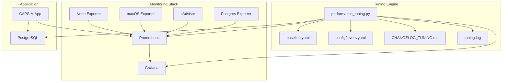

# 🛠️ DevOps AI Playbook — Iterative Performance Tuning

## Overview

This directory contains a complete implementation of the DevOps AI Playbook for iterative performance tuning. The system automatically monitors Postgres performance in Docker on M1 Air and applies systematic tuning to maintain SLA compliance.

## SLA Targets

- **CPU Temperature** ≤ 85°C (5 min avg)
- **IO-wait** < 25% (5 min avg)  
- **P95 write-latency** ≤ 200ms
- **WAL rate** ≤ 1.5× baseline peak

## Architecture



## Quick Start

### 1. Setup macOS Monitoring

```bash
# Install required tools and setup monitoring
make setup-macos-monitoring
```

### 2. Start Monitoring Stack

```bash
# Start all services including new exporters
make dev-up
```

### 3. Check Monitoring

```bash
# Verify all services are running
make check-health

# Check performance metrics
make performance-status
```

### 4. Run Performance Tuning

```bash
# Establish baseline (first time)
make performance-baseline

# Run automated tuning loop
make performance-tuning
```

## Files Structure

```
.
├── baseline.yaml              # Performance baseline metrics
├── config/levers.yaml         # Tuning parameters by cost/symptom
├── CHANGELOG_TUNING.md        # Audit trail of tuning changes
├── tuning.log                 # Detailed tuning process logs
└── scripts/
    ├── performance_tuning.py  # Main tuning automation
    ├── run_tuning_loop.sh     # Complete tuning workflow
    └── setup_macos_exporter.sh # macOS monitoring setup
```

## Tuning Process

### Step 1: Establish Baseline

The system queries Prometheus for key metrics:

```yaml
metrics:
  wal_write_rate:
    query: "rate(pg_wal_lsn_bytes_total[5m])"
    value_bytes_per_sec: 1234567
  
  cpu_temperature:
    query: "max(macos_cpu_temperature_celsius)"
    value_celsius: 72
  
  io_wait_percentage:
    query: "avg(rate(node_cpu_seconds_total{mode=\"iowait\"}[2m]))"
    value_percent: 15.5
  
  p95_write_latency:
    query: "histogram_quantile(0.95, rate(capsim_event_latency_ms_bucket[5m]))"
    value_ms: 180
```

### Step 2: Apply Cheapest Lever

Based on SLA violations, the system selects the most cost-effective tuning lever:

```yaml
# Example: High WAL rate detected
symptom_mappings:
  high_wal_rate:
    - "checkpoint_timeout"    # LOW COST
    - "batch_size"           # LOW COST  
    - "wal_buffers"          # LOW COST
```

### Step 3: Wait and Monitor

System waits 15 minutes or one load cycle, continuously logging metrics:

```json
{
  "timestamp": "2024-01-15T10:30:00Z",
  "wal_rate": 1234567,
  "cpu_temp": 72,
  "io_wait": 15.5,
  "p95_latency": 180
}
```

### Step 4: Alert Feedback

Custom alerts trigger automatic rollback or next-lever selection:

- `CpuTemperatureHigh` → thermal throttling risk
- `HighIOWait` → disk contention
- `WalSpikes` → checkpoint/write issues
- `P95WriteLatencyHigh` → query performance

### Step 5: Document Results

All changes are tracked in the audit trail:

```markdown
## 2024-01-15 10:30

* Lever: checkpoint_timeout=10min
* Goal metric: wal_rate from 1234567 → 987654
* Result: ✅ improved
```

## Tuning Levers

### Low Cost (No Restart Required)

| Lever | Target | Impact | Risk |
|-------|--------|---------|------|
| `checkpoint_timeout` | WAL spikes | Lower checkpoint frequency | Low |
| `checkpoint_completion_target` | IO spikes | Spread checkpoint IO | Low |
| `wal_buffers` | WAL contention | Better WAL buffering | Low |
| `batch_size` | Transaction rate | Fewer transactions | Low |

### Medium Cost (Restart Required)

| Lever | Target | Impact | Risk |
|-------|--------|---------|------|
| `shared_buffers` | Disk IO | Better cache hit ratio | Medium |
| `work_mem` | Query performance | In-memory operations | Medium |
| `effective_cache_size` | Query plans | Better planning | Low |

### High Cost (Infrastructure Changes)

| Lever | Target | Impact | Risk |
|-------|--------|---------|------|
| `docker_memory_limit` | Memory pressure | More memory for buffers | High |
| `docker_cpu_limit` | CPU throttling | Better CPU availability | High |
| `connection_pooling` | Connection overhead | Lower connection cost | High |

## Monitoring Stack

### Prometheus Targets

- **capsim-app**: Application metrics (`:8000/metrics`)
- **postgres-exporter**: Database metrics (`:9187/metrics`)
- **node-exporter**: System metrics (`:9100/metrics`)
- **cadvisor**: Container metrics (`:8080/metrics`)
- **macos-exporter**: macOS-specific metrics (host)

### Key Metrics

```promql
# WAL write rate
rate(pg_wal_lsn_bytes_total[5m])

# CPU temperature (macOS)
max(macos_cpu_temperature_celsius)

# IO wait percentage
avg(rate(node_cpu_seconds_total{mode="iowait"}[2m])) * 100

# P95 write latency
histogram_quantile(0.95, rate(capsim_event_latency_ms_bucket[5m]))
```

### Grafana Dashboards

Access at `http://localhost:3000`:

- **CAPSIM Overview**: Application performance
- **PostgreSQL**: Database metrics
- **System Metrics**: Host performance
- **Performance Tuning**: Tuning-specific dashboard

## Troubleshooting

### Common Issues

1. **macOS Monitoring Not Working**
   ```bash
   # Check if node_exporter is running
   curl http://localhost:9100/metrics
   
   # Restart if needed
   launchctl unload ~/Library/LaunchAgents/homebrew.node_exporter.plist
   launchctl load ~/Library/LaunchAgents/homebrew.node_exporter.plist
   ```

2. **Prometheus Targets Down**
   ```bash
   # Check Prometheus targets
   curl http://localhost:9091/targets
   
   # Restart monitoring stack
   docker-compose restart prometheus
   ```

3. **Performance Tuning Fails**
   ```bash
   # Check logs
   tail -f tuning.log
   
   # Check script permissions
   ls -la scripts/
   ```

### Manual Rollback

If automated tuning causes issues:

```bash
# Restore from backup
cp backups/20240115_103000/postgresql.conf monitoring/
cp backups/20240115_103000/.env .

# Restart services
docker-compose restart postgres app
```

## Advanced Usage

### Custom Levers

Add new tuning parameters to `config/levers.yaml`:

```yaml
levers:
  low_cost:
    - name: "custom_parameter"
      description: "Custom tuning parameter"
      target_symptom: "custom_issue"
      config_file: "monitoring/postgresql.conf"
      parameter: "custom_setting"
      default_value: "default"
      recommended_values: ["value1", "value2"]
```

### Custom Alerts

Add performance alerts to `monitoring/alerts.yml`:

```yaml
- alert: CustomPerformanceAlert
  expr: custom_metric > threshold
  for: 5m
  labels:
    severity: warning
    tuning_trigger: true
  annotations:
    summary: "Custom performance issue detected"
```

### Batch Operations

Run multiple tuning cycles:

```bash
# Run 5 cycles maximum
MAX_CYCLES=5 ./scripts/run_tuning_loop.sh

# Run until SLA compliance
./scripts/run_tuning_loop.sh
```

## Development

### Adding New Exporters

1. Add to `docker-compose.yml`:
   ```yaml
   new-exporter:
     image: prom/new-exporter:latest
     ports:
       - "9999:9999"
   ```

2. Add to `monitoring/prometheus.yml`:
   ```yaml
   - job_name: 'new-exporter'
     static_configs:
       - targets: ['new-exporter:9999']
   ```

### Extending Tuning Logic

Modify `scripts/performance_tuning.py`:

```python
def custom_tuning_logic(self):
    # Add custom tuning logic here
    pass
```

## Security Considerations

- Monitor system resource usage during tuning
- Backup configurations before applying changes
- Set reasonable resource limits
- Monitor for thermal throttling
- Use staged rollouts for high-risk changes

## Performance Targets

| Environment | CPU Temp | IO Wait | P95 Latency | WAL Rate |
|-------------|----------|---------|-------------|----------|
| Development | ≤ 85°C | < 25% | ≤ 200ms | ≤ 1.5× baseline |
| Staging | ≤ 80°C | < 20% | ≤ 150ms | ≤ 1.3× baseline |
| Production | ≤ 75°C | < 15% | ≤ 100ms | ≤ 1.2× baseline |

## Maintenance

### Regular Tasks

```bash
# Weekly: Check tuning history
make performance-status

# Monthly: Review and archive logs
gzip tuning.log && mv tuning.log.gz logs/archive/

# Quarterly: Update tuning parameters
vim config/levers.yaml
```

### Monitoring Health

```bash
# Check monitoring stack health
make check-health

# Verify all exporters
curl http://localhost:9091/targets

# Check Grafana dashboards
curl http://localhost:3000/api/health
``` 